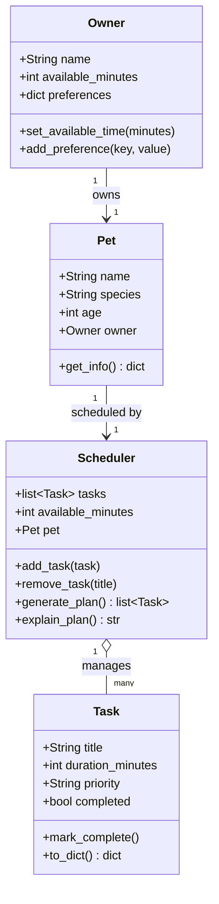

# PawPal+ Class Diagram

```mermaid
classDiagram
    class Owner {
        +String name
        +int available_minutes
        +dict preferences
        +set_available_time(minutes)
        +add_preference(key, value)
    }

    class Pet {
        +String name
        +String species
        +int age
        +Owner owner
        +get_info() dict
    }

    class Task {
        +String title
        +int duration_minutes
        +String priority
        +bool completed
        +mark_complete()
        +to_dict() dict
    }

    class Scheduler {
        +list~Task~ tasks
        +int available_minutes
        +Pet pet
        +add_task(task)
        +remove_task(title)
        +generate_plan() list~Task~
        +explain_plan() str
    }

    Owner "1" --> "1" Pet : owns
    Pet "1" --> "1" Scheduler : scheduled by
    Scheduler "1" o-- "many" Task : manages
```
